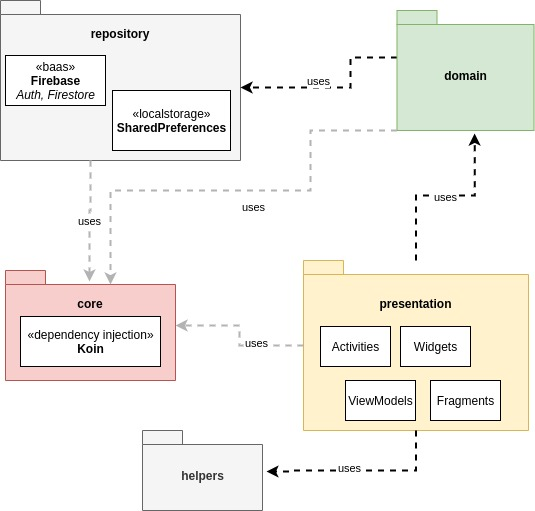

# CrazyMath

## Project

### Project Description 
CrazyMath is a project for children to practice mathematics as the game. I thought this Idea when I remember of Cross-words, but I change it to be a kind of Cross-numbers game.

### Problem Target
- The children that has difficulties in basic mathematics operations.

### Teaser

---

## Architecture and Stack Overview

